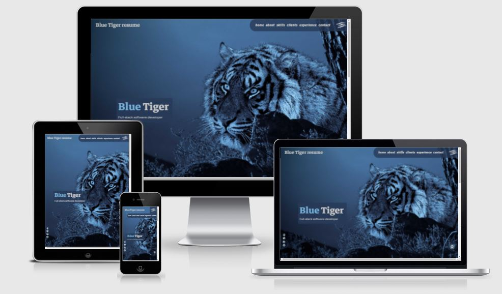
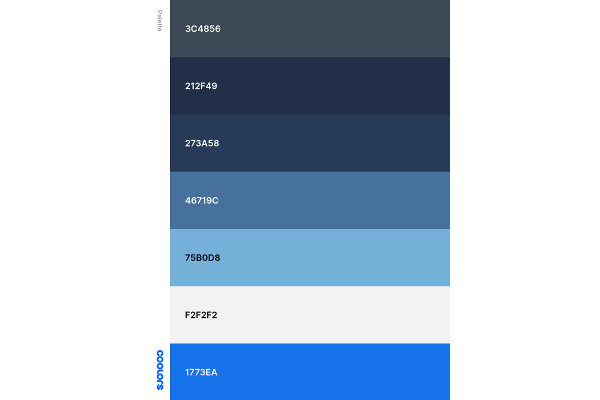

# Blue Tiger Resume

The "Blue Tiger resume" is a resume website for an imagined full stack software developer.

The purpose of this website is to create an on-line presence for a wannabe coder. No real info, based on random full stack software developer resume. The website is for recruiters, potential clients, peers and why not, assessors. 
The look, brand name and colours come from the image used on the main page.

Visit live website: [https://christ-cc.github.io/blue-tiger-resume/](https://christ-cc.github.io/blue-tiger-resume/)

## Table of contents
1. [UX](#UX)
    - [User Stories](#User-stories)
    - [Structure](#Structure)
    - [Skeleton](#Skeleton)
    - [Surface](#Surface)
2. [Features](#Features)
    - [Existing Features](#existing-features) 
        - [Navigation menu](#Navigation-menu)
        - [The landing page](#The-landing-page)
        - [About section](#About-section)
        - [Skills section](#Skills-section)
        - [Clients section](#Clients-section)
        - [The footer](#The-footer)
            - [Social media links](#Social-media-links)
            - [Up arrow](#Up-arrow)
            - [Copyright](#Copyright)
        - [Experience page](#Experience-page)
        - [Contact page](#Contact-page)
    - [Features left to implement](#features-left-to-implement)
3. [Technologies Used](#Technologies-Used)
4. [Testing](#Testing)
5. [Deployment](#Deployment)
6. [Credits](#Credits)

## UX
In this section you'll find elements of UX process.

### User stories

- The developer wants to establish an on-line presence, to find work.
- The owner wants an image and cover text on the main page to visualy explain what the website is about.
- The owner wants floating social media icons always visible, to offer easy acces to further details.
- Recruiters want to see owners name (or brand name) and position to find out what type of coder te owner is.
- Recruiters want to see owner's skills to be able to evaluate coder's level.
- Recruiters want to see owner's past and current jobs to evaluate coder's experience and availability.
- Recruiters want to see past clients to find out if they deal with a genine coder with real clients.
- Any user wants to see a simple to use and clean looking website to have easy access to information.
- Any user wants an easy way to navigate the website to save time and avoid frustration.
- Any user wants a responsive website to be able to use it on their device of choice.
- Any user wants to be able to get in touch with the owner to be able to ask for a service, or just to leave a messege.
- Recruiters want to be able to download a classic resume to use it in their hiring process.

### Structure
The website has a simple structure with 3 different pages and 3 sections on the main page. A minimalistic text content was used with emphasis on visual elements.
- Main page contains a brand hero image and owner position
    - About section gives a short description and links contact page
    - Skills section shows coding skills
    - Clients section presents a portfolio of past clients
- Experience page contains a timeline of past jobs
- Contact page gives owners details and the posibility of contact
- [Site map](assets/readme/site-map.pdf)

### Skeleton
In this section wireframes were created. Initial simple, hand drawn wireframes were refined in [Balsamiq](https://balsamiq.com/) and presented below.
- [Main page wireframes](assets/readme/main-page.pdf)
- [Experience page wireframes](assets/readme/experience-page.pdf)
- [Contact page wireframes](assets/readme/contact-page.pdf)

### Surface
In this section you'll find info on website's look and feel. 
#### Colours
The look of the landing page was inspired from [this website](). The website was designed with anonymity in mind. While searching for an aproprite hero image, the tiger image was found. That image inspired the branding and colours for the project.

A shade of blue, predominant in the tiger's image background, was used  ([ColorZilla](https://www.colorzilla.com/)) as body background colour. Different shades of that blue were used throughout the project, depending on necessity. The blue shades used were obtained with [ColorSpace](https://mycolor.space/).

Light blue from tiger's eye was used to emphasize navigation hovering, the word "Blue" in cover text on main page and other elements.

A light gray was used instead of pure white for most text and other elements. The original light gray was changed with a different, lighter shade after testing for contrast with [WebAIM](https://webaim.org/resources/contrastchecker/).

For hovering over social media icons and up arrow link, a shade of blue was used, similar with facebook blue to offer contrast.

The website's palette saved from [coolors](https://coolors.co/3c4856-212f49-273a58-46719c-75b0d8-f2f2f2-1773ea) can be seen bellow:

#### Language
A descriptive language was used with a minimalistic text content. [Google Fonts](https://fonts.google.com/) were used to create a clean look. Thick compact font for navigation menu to be visible on smaller screens. A strong font for logo and headers with a suggestet paired font for the rest of the text.

## Features
In this section, you can find implemented features as well as some features left for a future development stage.

## Existing Feature
### - Navigation menu 
###  -The landing page
### About section
### Skills section
### Clients section
### The footer
   - #### Social media links
   - #### Up arrow 
   - #### Copyright
### Experience page
### Contact page

## Features Left to Implement
- Download resume
- Projects page (so you don't necessarily have to check github)
- Live social media links
- Education page
- Password protected access to website

## Technologies Used
1. [HTML](https://en.wikipedia.org/wiki/HTML) - Programming language used for website structure and content
2. [CSS](https://en.wikipedia.org/wiki/CSS) - Programming language used for styling website
3. [Font Awesome](https://fontawesome.com/) - Social media icon library
4. [Google Fonts](https://fonts.google.com/) - Free font styles to use on website
5. [Compressjpeg](https://compressjpeg.com/) - For compressing image file sizes to maximise loading speed
6. [Balsamiq](https://balsamiq.com/) - Used to create wireframes
7. [Am I Responsive?](http://ami.responsivedesign.is/) - To check responsiveness and for mockups
8. [Gitpod](https://www.gitpod.io/) - IDE (Integrated Development Environment), for writing, editing and saving code
9. [GitHub](https://github.com/) - Code repository hosting platform
10. [ColorZilla](https://www.colorzilla.com/) - Browser extension for sampling colours on a website
11. [ColorSpace](https://mycolor.space/) - Colour palette generator
12. [coolors](https://coolors.co/3c4856-212f49-273a58-46719c-75b0d8-f2f2f2-1773ea) - Colour palette generator
13. [WebAIM](https://webaim.org/resources/contrastchecker/) - contrast checker

## Testing
In this section, you need to convince the assessor that you have conducted enough testing to legitimately believe that the site works well. Essentially, in this part you will want to go over all of your user stories from the UX section and ensure that they all work as intended, with the project providing an easy and straightforward way for the users to achieve their goals.

Whenever it is feasible, prefer to automate your tests, and if you've done so, provide a brief explanation of your approach, link to the test file(s) and explain how to run them.

For any scenarios that have not been automated, test the user stories manually and provide as much detail as is relevant. A particularly useful form for describing your testing process is via scenarios, such as:

1. Contact form:
1. Go to the "Contact Us" page
1. Try to submit the empty form and verify that an error message about the required fields appears
1. Try to submit the form with an invalid email address and verify that a relevant error message appears
1. Try to submit the form with all inputs valid and verify that a success message appears.
In addition, you should mention in this section how your project looks and works on different browsers and screen sizes.

You should also mention in this section any interesting bugs or problems you discovered during your testing, even if you haven't addressed them yet.

If this section grows too long, you may want to split it off into a separate file and link to it from here.

## Deployment
This section should describe the process you went through to deploy the project to a hosting platform (e.g. GitHub Pages or Heroku).

In particular, you should provide all details of the differences between the deployed version and the development version, if any, including:

Different values for environment variables (Heroku Config Vars)?
Different configuration files?
Separate git branch?
In addition, if it is not obvious, you should also describe how to run your code locally.

## Credits
### Content
<-- (The text for section Y was copied from the Wikipedia article Z)
CI template
### Media
The photos used in this site were obtained from ...
### Acknowledgements
- CI
- Mentor
- Russell

<-- (I received inspiration for this project from X)