# Blue Tiger Resume

## Table of contents
1. [Validation](#Validation)
    - [HTML](#HTML)
    - [CSS](#CSS)
    - [Links](#Links)
1. [Lighthouse](#Lighthouse)
1. [Browser compatibility](#Browser-compatibility)
1. [Responsiveness](#Responsiveness)
1. [User stories](#User-stories)
1. [Manual testing](#Manual-testing)
1. [Fixed Bugs](#Fixed-bugs)
1. [Bugs left](#Bugs-left)

## Validation
### - HTML
All html files were checked with [W3 Markup Validation Service](https://validator.w3.org/). 
While [index.hml](images/index-html-validation.jpg) and [contact.html](images/contact-html-validation.jpg) had no errors, experience.html had some [errors](images/experience-html-validation-errors.jpg) and a warning. 

Basically the validator says that a `
` element is not allowed inside a `<i>` element. As a remainder, the '[div](images/div-error.jpg)' (with class .job-container) in question defines the dimension and position of the [job card](images/job-card.jpg) and is a child of `<i>` element, because it uses it's vertical position. With `<i>` element beeing a [Font Awesome](https://fontawesome.com/) icon, used as an anchor on the timeline for the job card. This error was fixed by changing the `
` and it's content as a sibling of `<i>` element and adjust its position accordingly throughout all media queries in the css file. 

The second error was the use of an id in multiple places and it was fixed by changing the id to a class.  

The lesson learned here was to validate the html code at each modification throughout development and not just at the end of the project.

The other two small pages (submit.html and 404.html) were validated with no errors

[Back to top](#Table-of-contents)
### - CSS
The css file was checked with  [W3 CSS Validation Service](https://jigsaw.w3.org/css-validator/) with no errors, but with 4 warnings.

Same colour was used for an element and its border. The border styling was used just for testing the dimension and position of the element and forgotten in code. It was removed after testing.

[Back to top](#Table-of-contents)
### - Links
The links were checked with [W3 Link Checker](https://validator.w3.org/checklink) and it was suggested to change the github link from "https://www.github.com/" to "https://github.com/" and to manualy check the rest of social media links, which was done.

[Back to top](#Table-of-contents)
## Lighthouse
Lighthouse was used to test wesite's performance. 

Initial testing revealed that the **images** used were to large and delayed loading. The solution was to edit and resize images in Gimp and then compress them with [Compressjpeg](https://compressjpeg.com/). 

A later testing revealed a **contrast** problem in contact page, which lead to a contrast testing with [WebAIM](https://webaim.org/resources/contrastchecker/). As a result, the text colour was replaced with a lighter shade of gray which gave good results in testing.

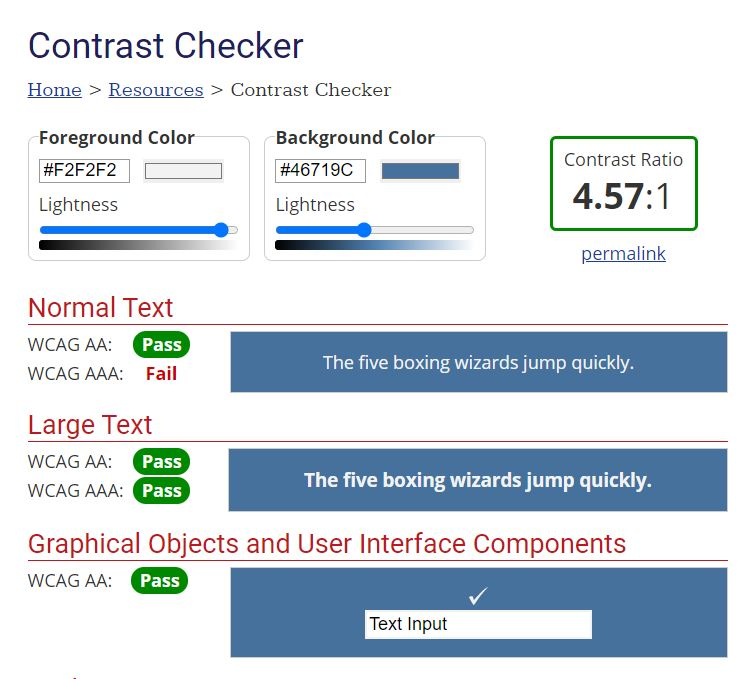

Latest results were over 97% and were considered good, so no further changes were made. 

The results can be found here: [index.html](lighthouse-index-desktop), [experience.html](lighthouse-experience-desktop) and [contact.html](lighthouse-contact-desktop)

[Back to top](#Table-of-contents)
## Browser compatibility
[PowerMapper](https://www.powermapper.com/products/sortsite/checks/browser-compatibility/) was used to check browser compatibility. The results were good, except for Internet Explorer. That however didn't cause any worries because this browser was replaced with Edge by Microsoft and it's no longer [supported](https://www.microsoft.com/en-gb/microsoft-365/windows/end-of-ie-support)
See test results below:

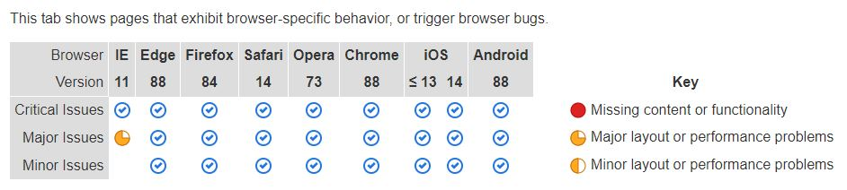
[Back to top](#Table-of-contents)
## Responsiveness
Responsiveness was tested throughout development at each stage with [Chrome DevTools](https://developer.chrome.com/docs/devtools/). All screens from [Chrome DevTools](https://developer.chrome.com/docs/devtools/) were used. Additionally more devices screens were tested with [PowerMapper](https://www.powermapper.com/products/sortsite/checks/browser-compatibility/).

[Back to top](#Table-of-contents)
## User stories
#### As a website owner 
- I want to establish a strong on-line presence, to find work.

    The main page contains a brand hero image and owner position to visualy explain what the website is about.

- I want my users to be able to use the website intuitivley and easy

    Each page has a navigation menu and is accessible at all times. All website is presented with minimalistic text content.

- I want to create and maintain a relationship with potential users

    The user has a few ways to contact the owner. There are social media links floating at the bottom left corner of every page. There is a contact form and a link to it from about section.

#### As a website user 
- I want to find information about the owner to check his qualification and skills

    About section gives a short description about the owner. Further details can be found in skills and clients sections.

- I want to see a simple to use and clean looking website so information is easy to access

    All website is presented in a simple minimalistic look. Well spaced visual pleasing content. The same colour scheme with a good contrast was used throughout the website.

- I want an easy way to navigate the website to save time and avoid frustration

    The menu is the same on all pages so it's quickly recognizable. Additionally there's an up link on all pages, that is useful on long scrollable pages.

- I want the website to be accessible on any desktop, tablet and mobile devices, to be able to use it on my device of choice

    The site is responsive. It was tested on many devices and browsers.

- I want to be able to get in touch with the owner to be able to ask for a service, or just to leave a message

    There is a form in contact page that offers the posibility to send a message back to the owner. There's links to it from the menu or from about section. Additionally there's personal info on the same page or social media links.

- I want to follow the owner on social media, so I can keep up with his latest news

    Discreet social media links are floating at the bottom left corner of every page.

[Back to top](#Table-of-contents)
## Manual testing
[Chrome DevTools](https://developer.chrome.com/docs/devtools/) was used throughout development at each stage for testing. 

Aditionally a comments/commented code/element colour method was used throughout development to make sense of CSS positioning, aligning and dimensioning as can be seen below. 

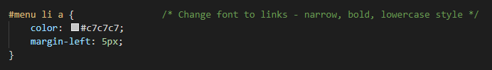
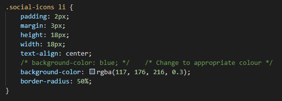
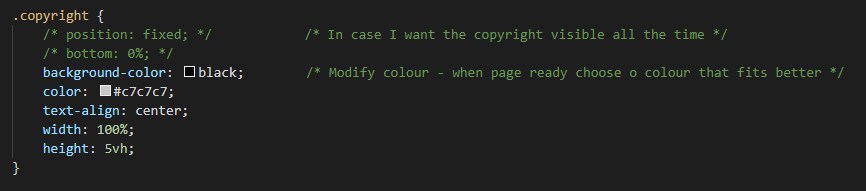
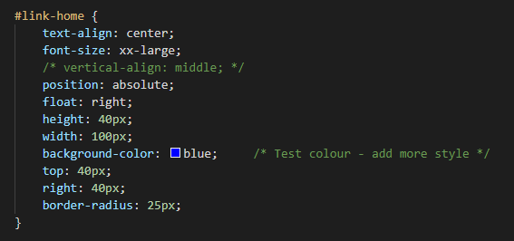
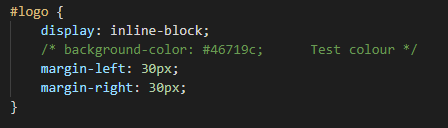
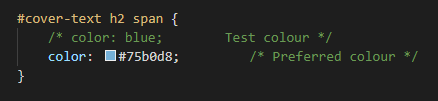
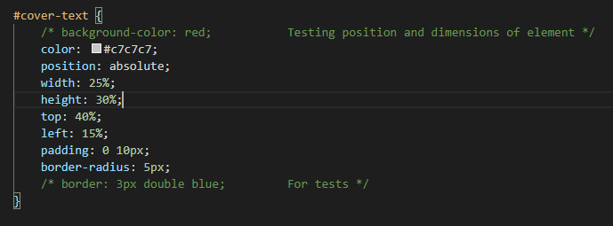
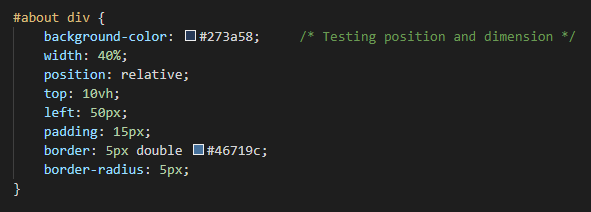
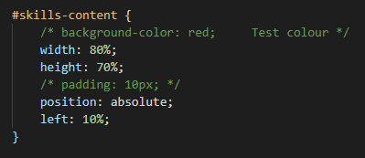

[Back to top](#Table-of-contents)

## Bugs left
- Some errors pointed out by Lighthouse

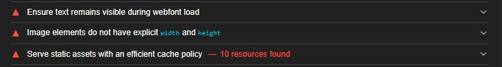

[Back to top](#Table-of-contents)
