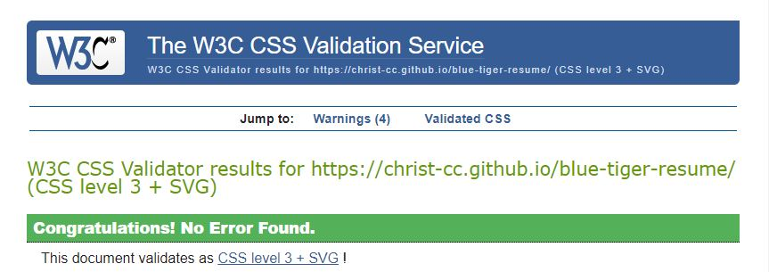
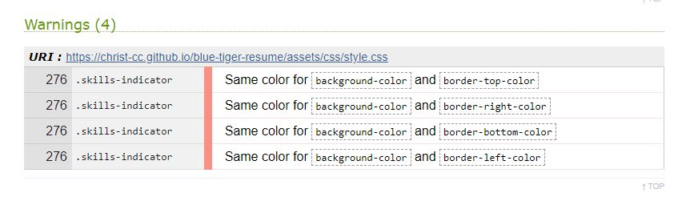

# Blue Tiger Resume

## Table of contents
1. [Validation](#Validation)
    - [HTML](#HTML)
    - [CSS](#CSS)
    - [Links](#Links)
1. [Lighthouse](#Lighthouse)
1. [Responsiveness](#Responsiveness)
1. [User stories](#User-stories)
1. [Fixed Bugs](#Fixed-Bugs)

## Validation
### - HTML
All html files were checked with [W3 Markup Validation Service](https://validator.w3.org/). 
While [index.hml](images/index-html-validation.jpg) and [contact.html](images/contact-html-validation.jpg) had no errors, experience.html had some [errors](images/experience-html-validation-errors.jpg) and a warning. 

Basically the validator says that a `
` element is not allowed inside a `<i>` element. As a remainder, the '[div](images/div-error.jpg)' (with class .job-container) in question defines the dimension and position of the [job card](images/job-card.jpg) and is a child of `<i>` element, because it uses it's vertical position. With `<i>` element beeing a [Font Awesome](https://fontawesome.com/) icon, used as an anchor on the timeline for the job card. 

Because the page looks as intended and no reference was found as to why ['i'](https://html.spec.whatwg.org/multipage/text-level-semantics.html#the-i-element) cannot contain a ['div'](https://html.spec.whatwg.org/multipage/grouping-content.html#the-div-element) as a child, the code was not modified, the errors were not corrected.

A posible solution to fix this errors could be to change the `
` and it's content as a sibling of `<i>` element and adjust its position accordingly throughout all media queries in the css file.  

The lesson learned here was to validate the html code at each modification throughout development and not just at the end of the project.

### - CSS
The css file was checked with  [W3 CSS Validation Service](https://jigsaw.w3.org/css-validator/) with no errors, but with 4 warnings.

Same colour was used for an element and its border. The border styling was used just for testing the dimension and position of the element and forgotten in code. It was removed after testing.
### - Links
The links were checked with [W3 Link Checker](https://validator.w3.org/checklink) and it was suggested to change the github link from "https://www.github.com/" to "https://github.com/" and to manualy check the rest of social media links, which was done.
## Lighthouse
Lighthouse was used to test wesite's performance. 

Initial testing revealed that the images used were to large and delayed loading. The solution was editing and resizing images in Gimp and then compressing them with [Compressjpeg](https://compressjpeg.com/). 

A later testing revealed a contrast problem in contact page, which lead to a contrast testing with [WebAIM](https://webaim.org/resources/contrastchecker/). As a result, the text colour was replace  with a lighter shade of gray which gave good results in testing. 

Latest results were over 97% and were considered good, so no further changes were made. 

The results can be found here: [index.html](lighthouse-index-desktop), [experience.html](lighthouse-experience-desktop) and [contact.html](lighthouse-contact-desktop)

## Responsiveness
## User stories
## Fixed Bugs

In this section, you need to convince the assessor that you have conducted enough testing to legitimately believe that the site works well. Essentially, in this part you will want to go over all of your user stories from the UX section and ensure that they all work as intended, with the project providing an easy and straightforward way for the users to achieve their goals.

Whenever it is feasible, prefer to automate your tests, and if you've done so, provide a brief explanation of your approach, link to the test file(s) and explain how to run them.

For any scenarios that have not been automated, test the user stories manually and provide as much detail as is relevant. A particularly useful form for describing your testing process is via scenarios, such as:

1. Contact form:
1. Go to the "Contact Us" page
1. Try to submit the empty form and verify that an error message about the required fields appears
1. Try to submit the form with an invalid email address and verify that a relevant error message appears
1. Try to submit the form with all inputs valid and verify that a success message appears.
In addition, you should mention in this section how your project looks and works on different browsers and screen sizes.

You should also mention in this section any interesting bugs or problems you discovered during your testing, even if you haven't addressed them yet.

If this section grows too long, you may want to split it off into a separate file and link to it from here.